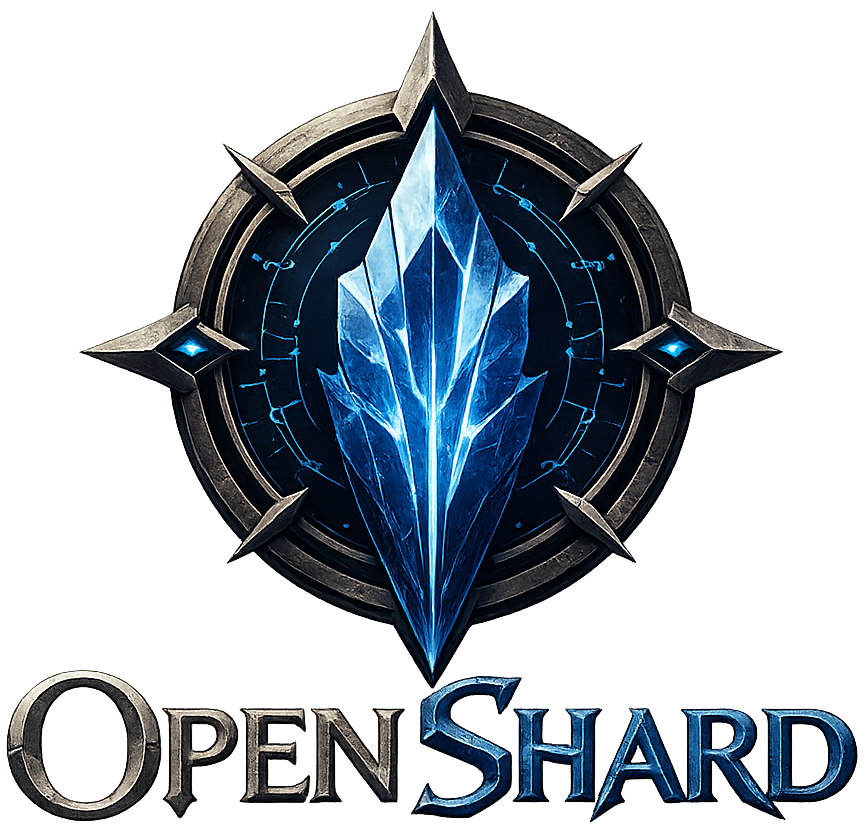
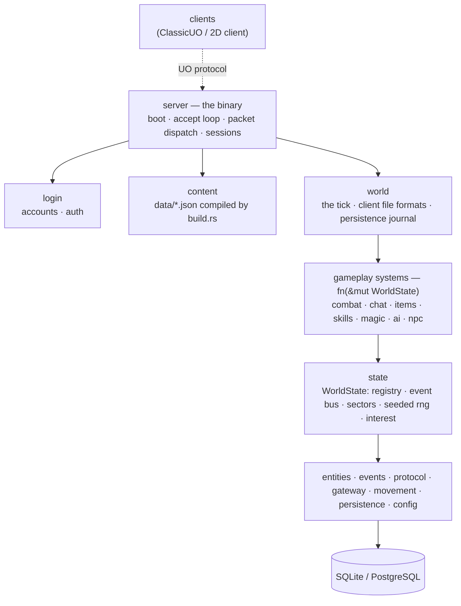

<p align="center">
  
</p>

# OpenShard

Modern open-source MMORPG server engine compatible with classic Ultima Online
clients.

Compatible with the UO **protocol** — the 2D client and ClassicUO — and with
nothing else. OpenShard is not a SphereServer clone. It is an attempt at the
engine Sphere would likely be if it were designed from scratch today: Rust,
data-oriented, deterministic, observable — and content that the compiler
checks.

> **Status: a small world lives.** `cargo run -p openshard-server` loads the
> client's map and takes clients through login and character creation into a
> ticking, shared world. Characters walk and run the same ground the client
> draws (the step rules are the client's own), pick things up, fill backpacks,
> wear clothes, ride horses, and buy and sell with vendors — including a mage who
> stocks reagents, an empty spellbook and the 64 Magery scrolls to scribe into
> it. They read the name of anything they click (or hover, with AoS cliloc
> tooltips) and act on it through a context menu. They fight creatures that fight
> back with real behaviour — line-of-sight aggro, pathing around walls, fleeing,
> kiting — gain skills into a live skill window, and cast only the spells in their
> book, whose poisons and Bless/Curse buffs persist through a relog. The **whole
> world** saves itself to SQLite or PostgreSQL without ever pausing — every NPC,
> every door, every debuff, every scribed spellbook — and survives a restart.
> Gameplay is Rust, and its content is data in this repository. See
> [`docs/README.md`](docs/README.md) for what each area does today, and
> [`plans/roadmap/PLAN.md`](plans/roadmap/PLAN.md) for what comes next.

See [release notes](docs/release_notes.md) for player-facing changes.

## Design

- **Everything is an entity.** No inheritance trees. Players, NPCs, items,
  houses and boats differ only by which components they carry.
- **Systems emit events; they do not call each other.** Combat emits
  `MobileDied`. Whoever cares reads it. Plugins, logging, metrics and replay
  fall out of this rather than being threaded through.
- **The tick is deterministic.** Commands queue, one fixed order applies them,
  randomness comes from a seeded rng the tick owns. Replay the same commands
  and you get the same world.
- **The world lives in memory.** The database is persistence, never a query
  target during a tick — and a save never stops the world.
- **Multi-era from day one.** Code asks what a client *can do*, never what
  version it is.
- **Gameplay is Rust, and content is data in this repository.** A rule is a
  `fn(&mut WorldState)` in a domain crate; a table of more than a hundred rows
  is `data/*.json` compiled by a `build.rs`. The validator is rustc.
- **No global state, no `unsafe`.**

Read [`docs/architecture.md`](docs/architecture.md) for the reasoning.

## Architecture

Arrows are dependencies; they only point down.


```mermaid
graph TD
    C["clients<br/>(ClassicUO / 2D client)"] -. UO protocol .-> server
    server["server — the binary<br/>boot · accept loop · packet dispatch · sessions"]
    login["login<br/>accounts · auth"]
    content["content<br/>data/*.json compiled by build.rs"]
    world["world<br/>the tick · client file formats · persistence journal"]
    systems["gameplay systems — fn(&amp;mut WorldState)<br/>combat · chat · items · skills · magic · ai · npc"]
    state["state<br/>WorldState: registry · event bus · sectors · seeded rng · interest"]
    foundation["entities · events · protocol · gateway · movement · persistence · config"]
    db[("SQLite / PostgreSQL")]

    server --> login
    server --> content
    server --> world
    world --> systems
    systems --> state
    state --> foundation
    foundation --> db
```

The tick sequences the systems in a fixed serial order — that is the price of a
deterministic, replayable simulation, and it is paid on purpose. Content is one
more consumer of the same seam every system uses: it enters as `Command`s the
tick applies in order, never as a direct write to the world.

## Layout

Three groups, and the direction of dependency is the point: `server` may depend
on `common`, `client` may depend on `common`, and the two never see each other.

```
crates/
  common/       everything both sides of the wire agree on
    protocol      versions, feature gates, packets, codec, framing
    entities      ECS: EntityId, Serial, sparse sets, Registry
    events        double-buffered typed event bus
    movement      the walk handshake, terrain rules, A* pathfinding
    config        TOML, validated at load
    metrics       counters                                stub, future
  server/       the shard
    gateway       sans-io connection + Tokio listener
    login         accounts, auth keys, the whole login sequence
    state         WorldState: components, sectors, rng, interest
    combat        damage, swings, ranged volleys, poison, notoriety, murder counts
    chat          speech in, speech out, speech ranges
    items         containers, drag/drop, stacking, decay, doors, mounts
    skills        checks, the gain curve
    magic         the 64-spell table, casting, typed damage, timed buffs
    crafting      six craft systems, 492 recipes, smelting
    ai            creature brains: LOS aggro, chase, kite, flee, give up
    npc           townsfolk: bankers, vendors, creature spawning
    quests        quest model, objectives, the gump
    world         the tick, client map/tiledata formats, the journal
    persistence   journal, snapshots, SQLite and PostgreSQL stores
    server        the binary — glue only
    housing guilds plugins                              stubs, future
  client/       our own client, beside the stock one — see docs/client/README.md
    net           the client's half of the wire: framing, login, a world view
    model         read models the wire and presentation layers share
    render        the isometric renderer and its lighting
    app           the binary: a window, a surface, a camera
    artscan       measures a client's art once and writes the table render reads
    pathtrace     a reference path tracer — a third opinion on a drawn scene
  e2e/          both ends in one process: playground, shard
tools/
  dashboard launcher map-editor cli                     planned
```

## Running

```sh
cargo run -p openshard-server
```

The first run writes an `openshard.toml` and starts on `0.0.0.0:2593` with a dev
account of `admin` / `hunter2`.

Point `world.client_files` at a UO client install to get a map. Without one the
shard still runs, but every step is allowed — players walk through walls and
across water.

Set `persistence.database` to a file path (SQLite) or a `postgres://` URL to
keep the world across restarts. Neither is a tier — SQLite runs a live shard
fine. Empty means in-memory: a real development mode, and the shard says so at
startup rather than implying it saves.

The one setting worth reading before you touch anything else is
`server.advertise`. It is **not** `server.listen`: it is the address the server
tells clients to dial, so it defaults to `127.0.0.1` and only works on the
machine running the shard. Behind NAT it must be your public address.

## Content

**There is no scripting language, and there will not be one.** A shard's
content — which creatures spawn where, what the townsfolk say and sell, where
Britain's doors and lamp-posts stand, what a quest asks for — is data in this
repository, compiled before the crate builds. Its logic is Rust, in the domain
crate that owns the rule.

This reverses an earlier answer, and the reversal is worth stating plainly
because the old one is still all over this project's history. Gameplay used to
be TypeScript on an embedded V8 (`deno_core`), loaded from a second repository
called the OpenShard Community Pack. That spike worked and retired the largest
technical risk on the roadmap. It is being deleted anyway. Decided in the open
on [#7](https://github.com/youhide/OpenShard/issues/7) and
[#17](https://github.com/youhide/OpenShard/issues/17); the reasoning, in short:

- **The pack was 98.6% data.** 28,219 of its 28,633 lines came out of a
  converter. The hand-written logic was 414 lines across four files, and six of
  the seventeen engine ops it ever called were bulk registration — a data file
  wearing a function's clothes. Nobody builds a language for 414 lines.
- **The line it drew was not a line.** Craft recipes and the skill table are
  ported ServUO data living in `crates/*/data/*.json`, compiled by a `build.rs`
  — a rule [`docs/architecture.md`](docs/architecture.md) already stated.
  Spawns and decoration are the same *kind* of thing, and they were in a second
  repository behind a V8. One of the two was in the wrong place, and it was not
  crafting.
- **rustc is a better validator than anything we would have written.** Every op
  spec field was `#[serde(default)]`, so a misspelt key was a silent default you
  discovered at 3am. A misspelt objective kind is now a build failure naming the
  file and the line.
- **One rng stream.** Pack loot drew from `Math.random` and documented itself as
  exempt from the engine's replayable-tick guarantee. That exemption is gone.
- **The seam the engine could not test.** `crates/server/scripting` was excluded
  from CI because `deno_core` downloads a prebuilt V8, so the one boundary
  between the world and its content was the one thing no automated test ran. The
  same dependency dragged MPL-2.0 into the tree.

**What it costs, stated as plainly as the benefits.** Writing content requires
Rust and a rebuild. Hot reload of logic goes away — today you edit a spawn and
it takes effect on save, and that stops being true. Both were accepted
knowingly. If a third party ever turns up wanting to write content without
compiling, that is the day a scripting layer comes back, and it will be a better
one for having been designed against a real user instead of an imagined one.

**It is done.** Everything the pack held is in the tree: skills, craft recipes,
quests, what the townsfolk say, the named regions, what spawns where, everything
Britain is furnished with, the townsfolk themselves with the stock they sell and
the escorts they ask for, the loot a corpse holds, and what the two shipped items
do. Each dataset moved in its own pull request, and each was proved by a test
that loaded the old pack and the new data side by side and compared the
`Command`s they produced. When the last one agreed, the runtime was deleted:
`crates/server/scripting`, the bridge beside it, `deno_core` and the
`[scripting]` config section are all gone, and `cargo test --workspace` runs the
whole workspace with nothing excluded for the first time.

A shard needs no second repository now. Point it at a client install and it comes
up furnished.

## A client of our own

The stock 2D client and ClassicUO stay first-class, and that is not a courtesy:
the server is written to the **protocol**, never to this client, and the two
never depend on each other. `crates/common/protocol` is the whole contract, and
keeping a second implementation honest on the far side of it is one of the
better tests this project has — the very first end-to-end run caught a client
that assumed one compressed block was one packet.

So why write one at all? The short answer is @enomado's, in
[#17](https://github.com/youhide/OpenShard/issues/17): *"I've been watching the
history of Ultima shards, and it's all pretty sad."* The longer answer is that
the reference client fixes decisions that do not have to be fixed, and no amount
of server work reaches them.

**The camera is the worked example.** ClassicUO puts the eye on the body, to the
pixel, every frame — so the view inherits the walk's discontinuities whole. A
rollback puts the body back a tile and the world jumps a tile; a kiting reversal
is a hard stop and a hard start 120ms apart. None of that is a bug in the
follow; it is the follow having no opinion. Ours detaches it — inertial and
free, the way Diablo's is — and
[`docs/client/design_camera_rig.md`](docs/client/design_camera_rig.md) is mostly not
about a camera at all: it is about one pipeline that every camera is a parameter
set of, and a bench that scores a parameter set against a scripted walk, so
which camera is right becomes something you measure rather than argue.

What that unlocks, in @enomado's words and roughly his order: tiles could be
dropped entirely; everyone could move at their own speed, with horses in the
world moving at theirs; a spell could survive three steps and break on five
instead of breaking on *a* step; mounted archery. Further out, a client that
runs in a browser on WASM **without downloading three gigabytes** — streaming
what a scene needs instead of shipping an install. Further out still, the shape
of something like FOnline rather than a 1997 client with better hardware under
it.

**What exists today**, in `crates/client/`: the wire in the other direction, a
`WorldView` of what the server has shown, ground, statics, mobiles, gumps, text,
speech, sound and interaction — drawn on `wgpu` with no engine underneath. Two
of the six crates are there only to keep the other four honest: `artscan`
measures a client's art once, off the clock, so the renderer reads a table
instead of guessing; `pathtrace` is a reference Monte Carlo path tracer whose
only job is to be a third opinion about a scene the renderer already drew. The
lighting engine is mid-rebuild — deferred shading, art as albedo, shadows by
primitive identity — and [`render/README.md`](docs/render/README.md) is
the one page that says where it actually stands rather than where it is going.

**Where this is honestly unsettled.** @enomado has written that he does not see
the point in staying tied to the Ultima protocol *"at least not a year from
now"*. Nothing has been decided there, and nothing in the tree points that way:
protocol compatibility is still the premise this engine is built on, and the
first line of [`docs/architecture.md`](docs/architecture.md) still says so. It
is recorded here because it is a real disagreement about the horizon, held in
the open by two people who agree about everything closer than it.

[`docs/client/README.md`](docs/client/README.md) is where that client stands, in
one page — readiness by subsystem and what is open, ranked; the milestones it was
built to are a record in its `evidence/`.

## Building

```sh
cargo test --workspace
cargo clippy --workspace --all-targets
cargo fmt --all
```

All three are expected to be silent, and CI runs exactly these on every pull
request.

## Contributing

Work lands through a pull request against a protected `main`. See
[`CONTRIBUTING.md`](CONTRIBUTING.md) for the flow, and
[`CLAUDE.md`](CLAUDE.md) for the rules that are easy to trip over — it is an
index, with [`docs/style.md`](docs/style.md) for how the code reads and
[`docs/findings.md`](docs/findings.md) for the traps already paid for.

Questions and project discussion are welcome on [Discord](https://discord.gg/GKa46DdAG9).

**No Ultima Online client files are in this repository and none ever will be.**
They are copyrighted. Point the engine at whatever install you already have.

## Stack

Rust + Tokio. SQLite or PostgreSQL, operator's choice. Gameplay and content are
Rust — no embedded runtime, no scripting language (see **Content** above). wgpu
for our own client. React and Next.js for tooling.

## Related projects

Other Rust work on the same client, worth reading before reinventing a wheel:

- [broker0/path_server](https://github.com/broker0/path_server) — a UO server
  in Rust.
- [broker0/ungine7](https://github.com/broker0/ungine7) — the same author's
  later Rust workspace (MIT): packet definitions, protocol detection and
  encryption, client data-file parsers, and server-side world/movement
  systems, plus example servers, clients and proxies. Research-oriented and
  early, but it covers the same wire and the same file formats we do.
- [AngryLawyer/uo-rust-libs](https://github.com/AngryLawyer/uo-rust-libs) —
  Rust libraries for the client's data files (`.mul` / `.uop` art, map,
  tiledata); the same ground `crates/server/world` covers.
- [hulryung-uo/anima-client](https://github.com/hulryung-uo/anima-client) —
  an Ultima Online client project.

## Licence

Dual-licensed under either of

- Apache License, Version 2.0 ([LICENSE-APACHE](LICENSE-APACHE))
- MIT license ([LICENSE-MIT](LICENSE-MIT))

at your option. This is the convention of the Rust ecosystem, and it is what
every crate in the workspace has always declared: MIT alone carries no patent
grant, and Apache-2.0 alone is incompatible with GPLv2 code, so offering both
leaves the choice with whoever uses this.

Copyleft was considered and dropped. A shard operator runs the server rather
than distributing it, so the GPL's condition is never triggered and the licence
buys nothing in this niche; and it puts `crates/common/protocol` out of reach of
every neighbouring project on this wire. A third argument was made at the time
and no longer holds: that copyleft would cast doubt over whether a script pack
loaded into the embedded V8 is a derivative work. There is no script pack now
(see **Content**), and the conclusion stands on the two reasons that survive it.

Unless you state otherwise, any contribution you intentionally submit for
inclusion in this work is dual-licensed as above, with no additional terms.
