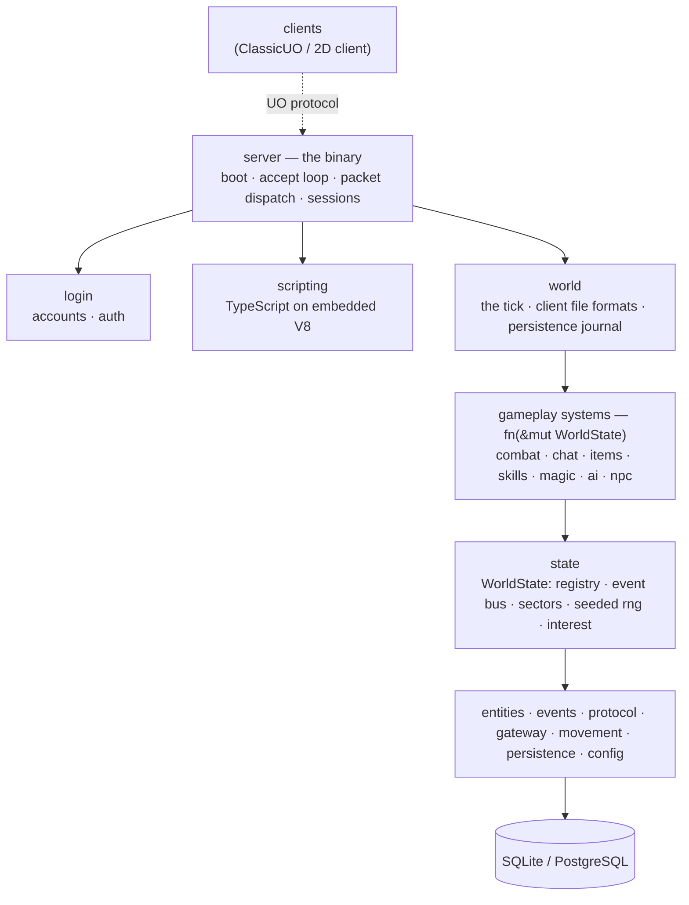

<p align="center">
  
</p>

# OpenShard

Modern open-source MMORPG server engine compatible with classic Ultima Online
clients.

Compatible with the UO **protocol** — the 2D client and ClassicUO — and with
nothing else. OpenShard is not a SphereServer clone. It is an attempt at the
engine Sphere would likely be if it were designed from scratch today: Rust,
data-oriented, script-first, hot-reloadable, observable.

> **Status: a small world lives.** `cargo run -p openshard-server` loads the
> client's map and takes clients through login and character creation into a
> ticking, shared world. Characters walk and run the same ground the client
> draws (the step rules are the client's own), pick things up, fill backpacks,
> wear clothes, ride horses, and buy and sell with vendors — including a mage who
> stocks reagents, an empty spellbook and the 64 Magery scrolls to scribe into
> it. They read the name of anything they click (or hover, with AoS cliloc
> tooltips) and act on it through a context menu. They fight creatures that fight
> back with real behaviour — line-of-sight aggro, pathing around walls, fleeing,
> kiting — gain skills into a live skill window, and cast only the spells in their
> book, whose poisons and Bless/Curse buffs persist through a relog. The **whole
> world** saves itself to SQLite or PostgreSQL without ever pausing — every NPC,
> every door, every debuff, every scribed spellbook — and survives a restart.
> Gameplay is TypeScript, hot-reloaded on save. See
> [`docs/roadmap.md`](docs/roadmap.md).

## Design

- **Everything is an entity.** No inheritance trees. Players, NPCs, items,
  houses and boats differ only by which components they carry.
- **Systems emit events; they do not call each other.** Combat emits
  `MobileDied`. Whoever cares reads it. Plugins, logging, metrics and replay
  fall out of this rather than being threaded through.
- **The tick is deterministic.** Commands queue, one fixed order applies them,
  randomness comes from a seeded rng the tick owns. Replay the same commands
  and you get the same world.
- **The world lives in memory.** The database is persistence, never a query
  target during a tick — and a save never stops the world.
- **Multi-era from day one.** Code asks what a client *can do*, never what
  version it is.
- **Gameplay is TypeScript.** Hot reloadable, no restart.
- **No global state, no `unsafe`.**

Read [`docs/architecture.md`](docs/architecture.md) for the reasoning.

## Architecture

Arrows are dependencies; they only point down.


```mermaid
graph TD
    C["clients<br/>(ClassicUO / 2D client)"] -. UO protocol .-> server
    server["server — the binary<br/>boot · accept loop · packet dispatch · sessions"]
    login["login<br/>accounts · auth"]
    scripting["scripting<br/>TypeScript on embedded V8"]
    world["world<br/>the tick · client file formats · persistence journal"]
    systems["gameplay systems — fn(&amp;mut WorldState)<br/>combat · chat · items · skills · magic · ai · npc"]
    state["state<br/>WorldState: registry · event bus · sectors · seeded rng · interest"]
    foundation["entities · events · protocol · gateway · movement · persistence · config"]
    db[("SQLite / PostgreSQL")]

    server --> login
    server --> scripting
    server --> world
    world --> systems
    systems --> state
    state --> foundation
    foundation --> db
```

The tick sequences the systems in a fixed serial order — that is the price of a
deterministic, replayable simulation, and it is paid on purpose. A script is one
more consumer of the same seam every system uses: events in, commands out, never
a direct write to the world.

## Layout

Three groups, and the direction of dependency is the point: `server` may depend
on `common`, `client` may depend on `common`, and the two never see each other.

```
crates/
  common/       everything both sides of the wire agree on
    protocol      versions, feature gates, packets, codec, framing
    entities      ECS: EntityId, Serial, sparse sets, Registry
    events        double-buffered typed event bus
    movement      the walk handshake, terrain rules, A* pathfinding
    config        TOML, validated at load
    metrics       counters                                stub, future
  server/       the shard
    gateway       sans-io connection + Tokio listener
    login         accounts, auth keys, the whole login sequence
    state         WorldState: components, sectors, rng, interest
    combat        damage, swings, ranged volleys, poison, notoriety, murder counts
    chat          speech in, speech out, speech ranges
    items         containers, drag/drop, stacking, decay, doors, mounts
    skills        checks, the gain curve
    magic         the 64-spell table, casting, typed damage, timed buffs
    crafting      the five craft systems, 485 recipes, smelting
    ai            creature brains: LOS aggro, chase, kite, flee, give up
    npc           townsfolk: bankers, vendors, creature spawning
    quests        quest model, objectives, the gump
    world         the tick, client map/tiledata formats, the journal
    persistence   journal, snapshots, SQLite and PostgreSQL stores
    scripting     the TypeScript runtime (deno_core)
    server        the binary — glue only
    housing guilds plugins                              stubs, future
  client/       nothing yet — the stock UO client is the client
tools/
  dashboard launcher map-editor cli                     planned
```

## Running

```sh
cargo run -p openshard-server
```

The first run writes an `openshard.toml` and starts on `0.0.0.0:2593` with a dev
account of `admin` / `hunter2`.

Point `world.client_files` at a UO client install to get a map. Without one the
shard still runs, but every step is allowed — players walk through walls and
across water.

Set `persistence.database` to a file path (SQLite) or a `postgres://` URL to
keep the world across restarts. Neither is a tier — SQLite runs a live shard
fine. Empty means in-memory: a real development mode, and the shard says so at
startup rather than implying it saves.

The one setting worth reading before you touch anything else is
`server.advertise`. It is **not** `server.listen`: it is the address the server
tells clients to dial, so it defaults to `127.0.0.1` and only works on the
machine running the shard. Behind NAT it must be your public address.

## The Community Pack

A shard's gameplay **data and logic** live in a script pack, not in the engine:
which creatures spawn where, what the townsfolk say and sell, how a spell the
core does not run resolves. The reference pack is the
[**OpenShard Community Pack**](https://github.com/youhide/OpenShard-Community-Pack)
— Britain's spawns, decoration, doors, bankers and vendors, migrated from
ServUO's data and edited as plain JavaScript.

```toml
[scripting]
main = "/path/to/OpenShard-Community-Pack"
```

`scripting.main` points at the pack's *directory*; the tree is watched, so
editing a spawn takes effect on save — no rebuild, no restart. A script never
touches the world directly: events in through `onEvent`, commands out through
ops, applied by the tick in order — the same seam every engine system uses.
Running without a pack works too; the engine's defaults (the spell table, the
skill rolls) still stand. This is the Sphere `Scripts-X` idea, redone on V8.

## Building

```sh
cargo test --workspace
cargo clippy --workspace --all-targets
cargo fmt --all
```

All three are expected to be silent, and CI runs exactly these on every pull
request.

## Contributing

Work lands through a pull request against a protected `main`. See
[`CONTRIBUTING.md`](CONTRIBUTING.md) for the flow, and
[`CLAUDE.md`](CLAUDE.md) for the rules that are easy to trip over — it is an
index, with [`docs/style.md`](docs/style.md) for how the code reads and
[`docs/findings.md`](docs/findings.md) for the traps already paid for.

**No Ultima Online client files are in this repository and none ever will be.**
They are copyrighted. Point the engine at whatever install you already have.

## Stack

Rust + Tokio. SQLite or PostgreSQL, operator's choice. TypeScript via embedded
V8 (`deno_core`) for gameplay. React and Next.js for tooling.

## Related projects

Other Rust work on the same client, worth reading before reinventing a wheel:

- [broker0/path_server](https://github.com/broker0/path_server) — a UO server
  in Rust.
- [broker0/ungine7](https://github.com/broker0/ungine7) — the same author's
  later Rust workspace: packet definitions, protocol detection and encryption,
  client data-file parsers, and server-side world and movement systems, plus
  example servers, clients and proxies. Research-oriented and early, but it
  covers the same wire and the same file formats we do.
- [AngryLawyer/uo-rust-libs](https://github.com/AngryLawyer/uo-rust-libs) —
  Rust libraries for the client's data files (`.mul` / `.uop` art, map,
  tiledata); the same ground `crates/server/world` covers.

## Licence

GNU General Public License, version 3 ([`LICENSE`](LICENSE)) — plus one
additional permission, in [`LICENSE-EXCEPTION`](LICENSE-EXCEPTION).

**Your script pack is yours.** Gameplay is TypeScript on an embedded V8, and
whether content loaded into a GPL process becomes a derivative work is the
oldest unsettled question in that licence. It is not left unsettled here: the
exception says in writing that scripts the runtime loads, and the data and
assets shipped with them, are a separate work, and may be licensed on any terms
— including commercial ones, including terms the GPL would otherwise forbid.
Whatever is compiled or linked into the binary is not covered by it, and stays
GPL whether or not a script calls it.

That line is the whole reason for copyleft here. What we want returned is
changes to the *engine*, and this scene distributes engines constantly —
prepackaged shard bundles, binaries, somebody's build handed to somebody else.
Each of those is a distribution, and each of them owes its recipients the source.
An operator running the server for players does not distribute anything and owes
nothing; that case is deliberately outside the licence rather than overlooked by
it, which is why this is GPL and not AGPL. A content ecosystem cannot grow if
hosting a pack is what triggers the obligation.

Unless you state otherwise, any contribution you intentionally submit for
inclusion in this work is licensed as above, with no additional terms — which
is what makes a CLA unnecessary.
