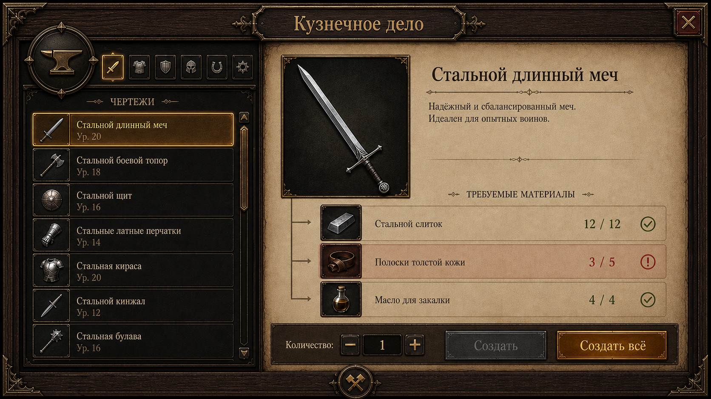

# Blacksmith crafting gump — visual prototype v1

This is a **visual target**, not a screenshot of an implemented client window.
It is an original dark-fantasy prototype generated from the user-provided
crafting-screen reference: the result keeps the useful material language
(walnut, aged parchment, brass, restrained amber) without treating that image
as a sprite sheet to copy.

The panel is 1672×941 pixels. It has a deliberately quiet rectangle outside
the art so an eventual game screen can put it over any world scene without
making the UI depend on a painted background.

## What survives into a real window

The picture should be rebuilt from pieces, not used as one background texture.
That keeps both the layout and the art scalable and lets the client draw real
Russian text and live quantities.

| Layer | Reusable asset / renderer primitive | Dynamic content |
| --- | --- | --- |
| Outer walnut shell | 9-slice `crafting-shell` plus four corner overlays | Window size, close button |
| Header plaque | fixed-width cap + tiled centre, or a 9-slice | title and profession emblem |
| Left pane | dark inset 9-slice | category tabs, recipe rows and scrollbar |
| Recipe row | neutral and selected 9-slice variants | icon, name, rank, availability marker |
| Right pane | parchment 9-slice | recipe title, description and materials |
| Preview | dark square 9-slice with four brass corners | item art / preview render |
| Material row | neutral and missing 9-slice variants | item icon, quantity, validation state |
| Bottom bar | dark inset 9-slice | stepper, enabled state and action buttons |
| Buttons | normal, hover, pressed, disabled faces | localised caption and click state |

## Layout contract

At the prototype's native scale, use these relationships rather than freezing
absolute pixel coordinates:

- The left pane is about **35%** of the inner width; the parchment is the
  remaining **65%**.
- The preview image and its caption own the top third of the parchment pane.
- Material rows stack below it with a fixed 12 px visual gap; their state is
  colour plus an icon, never colour alone.
- The bottom bar belongs to the whole window and stays visible while either
  pane scrolls.
- Only the recipe list scrolls in v1. The parchment has room for three
  material rows; a longer dependency list needs a deliberate second scrolling
  decision, not an accidental overflow.

## Next asset pass

The generated mockup is a style reference. The shipping asset pass should
generate or paint isolated transparent pieces at their native resolution:

1. outer-shell corners, horizontal/vertical edge strips and a quiet centre;
2. parchment and dark-inset 9-slice sets;
3. selected, normal and missing recipe/material row treatments;
4. button states and scrollbar parts;
5. one coherent icon family for skills and materials.

The existing `openshard-gump-render` then provides the fast loop for their
composition. Its scene carries the layout and real labels, while the client
gets an atlas format that can hold these project-owned pieces rather than only
the classic client's gump art.
